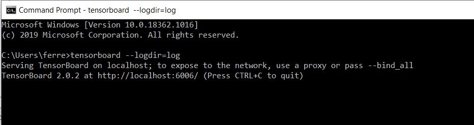

# Tensorboard-graph-problem-fixed-for-Google-Colab
# Purpose
I wanted to make a simple graph visualizing the architecture of my text classification algorithm and I came across Tensorboard graphs and thought I might give it a try. Sadly I kept getting an error that looks like this:<br />
<div align="left"></div>


So never fear!! I have found a solution to this issue so maybe it will help the few folks out there that use Google Colab. 

# Solution
You can go through the TensorBoard teams walkthrough to get started(https://github.com/tensorflow/tensorboard/blob/master/docs/graphs.ipynb) but where I found issue was when using the code:
``` Python
%tensorboard --logdir logs
```

So what I suggest is running everything on there that is needed i.e. tensorboard code, uploading the data, preprocessing steps to your problem, defining model(mine was already defined and I just uploaded it), and train the model. 

## Then follow these steps:

1. Go to your files on Google Colab and download the logged file under train(seen below)
<div align="left"></div><br />
2. Create a new folder called "log" and put the downloaded file in that folder. Place folder in the correct spot(you will see where in a second)<br />
3. Open your command prompt and type "tensorboard --logdir=log", but make sure the folder is in the correct spot for the command prompt to find it. As you see the photo my folder was in the C drive, users, and then my name.
<div align="left"></div><br />
4. Then highly over the local host webiste given and copy/paste that into a URL and you should get this:
<div align="left"></div><br />

# Results
Now I am a happy camper because I get to use my neural network graph! Hope this works!
<div align="left"></div><br />


