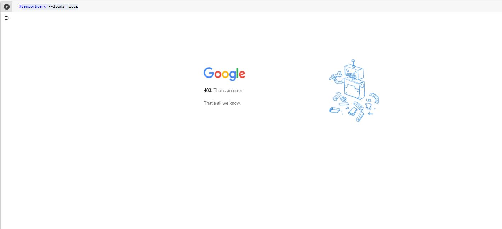

# Tensorboard-graph-problem-fixed-for-Google-Colab
I wanted to make a simple graph visualizing the architecture of my text classification algorithm and I came across Tensorboard graphs and thought I might give it a try. Sadly I kept getting an error that looks like this: 

So never fear!! I have found a solution to this issue so maybe it will help the few folks out there that use Google Colab. 

